

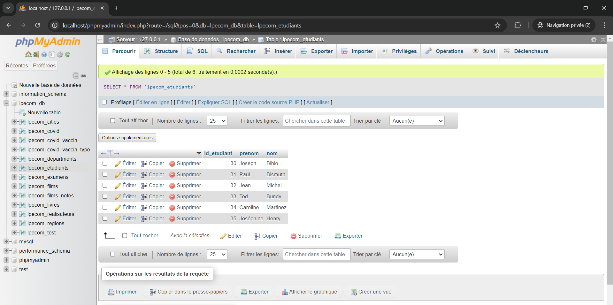

# sql-exercices
Ce repo contient les exercices SQL effectués lors de la formation POEC Java Sophia du 16/09 au 05/12/2024.  
L'ensemble des requêtes ont été exécutées sur le shell de XAMPP sous Windows.

# Connexion à phpmyadmin
La commande pour se connecter à phpmyadmin est la suivante :  
`mysql -h localhost -u root -p lpecom_db`

# Exercices

| Ex.1  | Quelle requête utiliser pour afficher l'ensemble des enregistrements de la table lpecom_livres ? |
| ------------- | ------------- |
| Réponse |  `select * from lpecom_livres;`  |

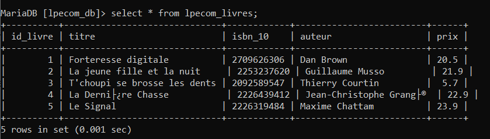

| Ex.2  | Quelle requête utiliser pour sélectionner uniquement les livres qui ont un prix strictement supérieur à 20 dans la table lpecom_livres ? |
| ------------- | ------------- |
| Réponse |  select * from lpecom_livres where prix > 20;  |

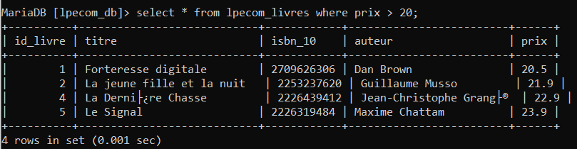

| Ex.3  | Quelle requête utiliser pour trier les enregistrements de la table lpecom_livres du prix le plus élevé au prix le plus bas ? |
| ------------- | ------------- |
| Réponse |  select * from lpecom_livres order by prix desc;  |

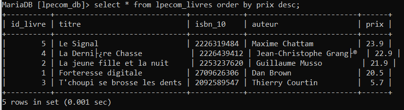

| Ex.4  | Quelle requête utiliser pour récupérer le prix du livre le plus élevé de la table lpecom_livres ? |
| ------------- | ------------- |
| Réponse |  select * from lpecom_livres order by prix desc limit 1;  |

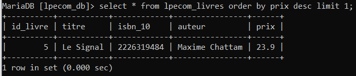

| Ex.5  | Quelle requête utiliser pour récupérer les livres de la table lpecom_livres qui ont un prix compris entre 20 et 22 ? |
| ------------- | ------------- |
| Réponse |  select * from lpecom_livres where prix >= 20 and prix <= 22;  |

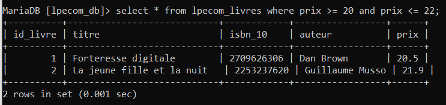

| Ex.6  | Quelle requête utiliser pour récupérer tous les livres de la table lpecom_livres à l'exception de celui portant la valeur pour la colonne isbn_10 : 2092589547 ? |
| ------------- | ------------- |
| Réponse |  select * from lpecom_livres where isbn_10 != 2092589547;  |

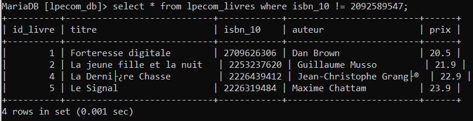

| Ex.7  | Quelle requête utiliser pour récupérer le prix du livre le moins élevé de la table lpecom_livres en renommant la colonne dans les résultats par minus ? |
| ------------- | ------------- |
| Réponse |  select prix as minus from lpecom_livres order by prix asc limit 1;  |

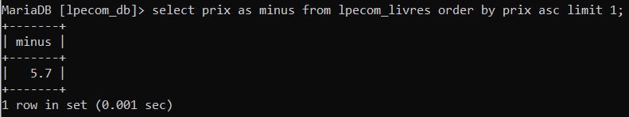

| Ex.8  | Quelle requête utiliser pour sélectionner uniquement les 3 premiers résultats sans le tout premier de la table lpecom_livres ? |
| ------------- | ------------- |
| Réponse |  select * from lpecom_livres order by prix desc limit 3 offset 1;  |

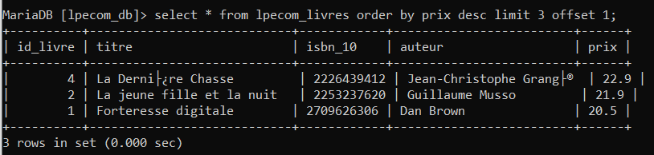

| Ex.9  | Quelle requête utiliser pour afficher l'id des étudiants qui ont participé à au moins un examen ? |
| ------------- | ------------- |
| Réponse |  select * from lpecom_etudiants as lpet, lpecom_examens as lpex where lpet.id_etudiant=lpex .id_etudiant;  |

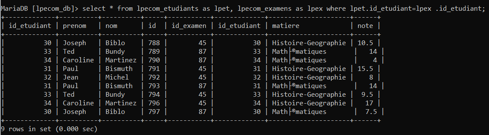

| Ex.10  | Quelle requête utiliser pour compter le nombre d'étudiants qui ont participé à au moins un examen ? |
| ------------- | ------------- |
| Réponse |  select count(distinct(lpecom_etudiants.id_etudiant)) as nbParticipantsExamen from lpecom_etudiants inner join lpecom_examens on lpecom_etudiants.id_etudiant=lpecom_examens.id_etudiant;  |

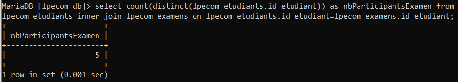

| Ex.11  | Quelle requête utiliser pour calculer la moyenne de l'examen portant l'id : 45 ? |
| ------------- | ------------- |
| Réponse |  select avg(note) from lpecom_examens where id_examen=45;  |

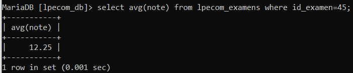

| Ex.12  | Quelle requête utiliser pour récupérer la meilleure note de l'examen portant l'id : 87 ? |
| ------------- | ------------- |
| Réponse |  select max(note) from lpecom_examens where id_examen=87;  |

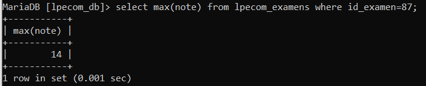

| Ex.13  | Quelle requête utiliser pour afficher l'id des étudiants qui ont eu plus de 11 à l'examen 45 ou plus de 12 à l'examen 87 ? |
| ------------- | ------------- |
| Réponse |  select id_etudiant from lpecom_examens where (id_examen=45 and note>11) or (id_examen=87 and note>12);  |

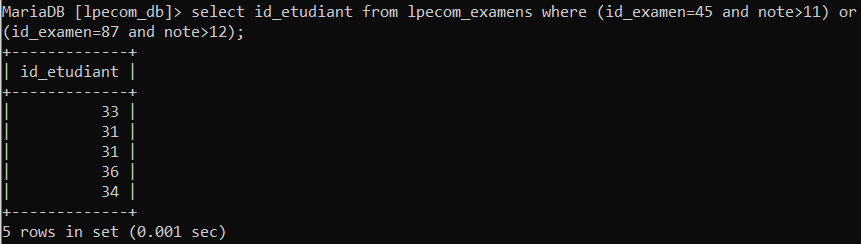

| Ex.14  | Quelle requête utiliser pour afficher tous les enregistrements de la table lpecom_examens avec en plus, si c'est possible, le prénom et le nom de l'étudiant ? |
| ------------- | ------------- |
| Réponse |  select * from lpecom_examens inner join lpecom_etudiants on lpecom_examens.id_etudiant=lpecom_etudiants.id_etudiant;  |

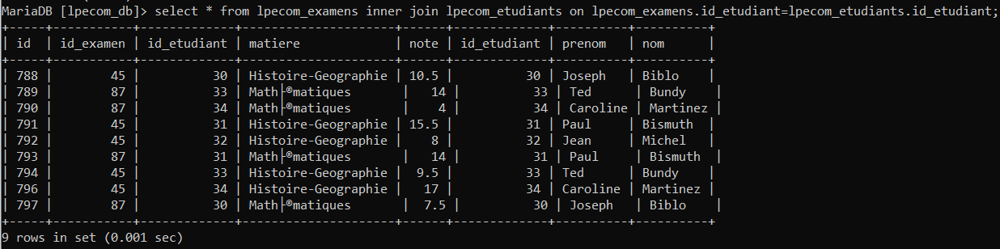

| Ex.15  | Quelle requête utiliser pour afficher les enregistrements de la table lpecom_examens avec le prénom et le nom de l'étudiant, uniquement quand les étudiants sont présents dans la table lpecom_etudiants ? |
| ------------- | ------------- |
| Réponse | select * from lpecom_examens inner join lpecom_etudiants where lpecom_examens.id_etudiant=lpecom_etudiants.id_etudiant;  |

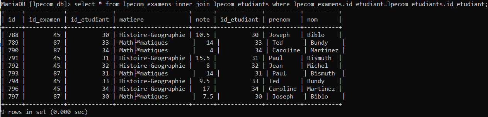

| Ex.16  | Quelle requête utiliser pour afficher uniquement le nom et le prénom de l'étudiant avec l'id : 30 avec la moyenne de ses deux examens dans une colonne moyenne ? |
| ------------- | ------------- |
| Réponse |  select nom, prenom, avg(note) as moyenne from lpecom_examens inner join lpecom_etudiants where lpecom_examens.id_etudiant=30;  |

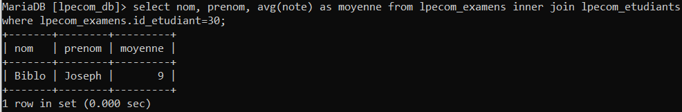

| Ex.17  | Quelle requête utiliser pour afficher les 3 meilleurs examens, du meilleur au moins bon, avec le prénom et le nom de l'étudiant associé ? |
| ------------- | ------------- |
| Réponse |  select * from lpecom_examens inner join lpecom_etudiants where lpecom_examens.id_etudiant=lpecom_etudiants.id_etudiant order by note desc limit 3;  |

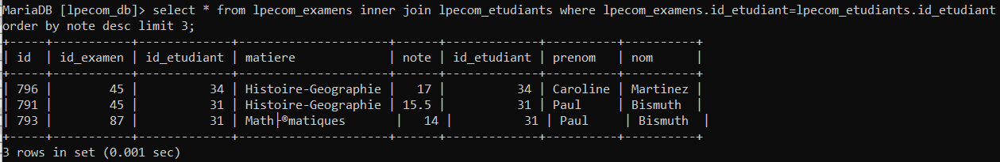

