

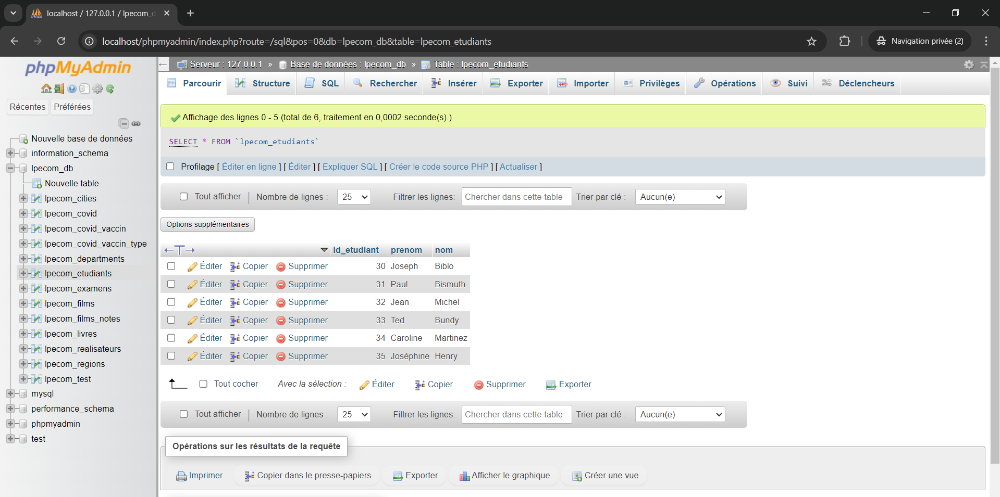

# sql-exercices
Ce repo contient les exercices SQL effectués lors de la formation POEC Java Sophia du 16/09 au 05/12/2024.  
L'ensemble des requêtes ont été exécutées sur le shell de XAMPP sous Windows.

# Connexion à phpmyadmin
La commande pour se connecter à phpmyadmin est la suivante :  
`mysql -h localhost -u root -p lpecom_db`

# Exercices

| Ex.1 | Quelle requête utiliser pour afficher l'ensemble des enregistrements de la table lpecom_livres ? |
| ------------- | ------------- |
| Réponse | `select * from lpecom_livres;` |
| - | 
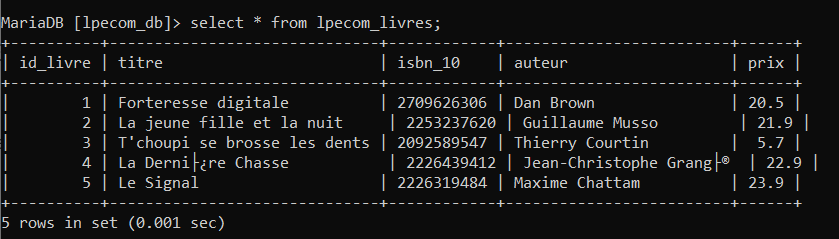
 |

| Ex.2 | Quelle requête utiliser pour sélectionner uniquement les livres qui ont un prix strictement supérieur à 20 dans la table lpecom_livres ? |
| ------------- | ------------- |
| Réponse | `select * from lpecom_livres where prix > 20;` |
| - | 
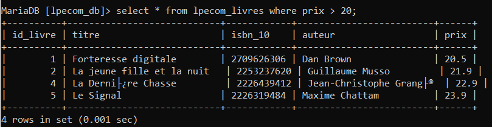
 |

| Ex.3 | Quelle requête utiliser pour trier les enregistrements de la table lpecom_livres du prix le plus élevé au prix le plus bas ? |
| ------------- | ------------- |
| Réponse | `select * from lpecom_livres order by prix desc;` |
| - | 
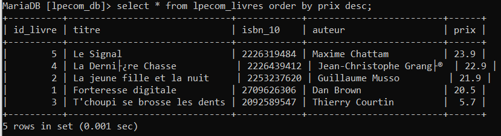
 |

| Ex.4 | Quelle requête utiliser pour récupérer le prix du livre le plus élevé de la table lpecom_livres ? |
| ------------- | ------------- |
| Réponse | `select * from lpecom_livres order by prix desc limit 1;` |
| - | 
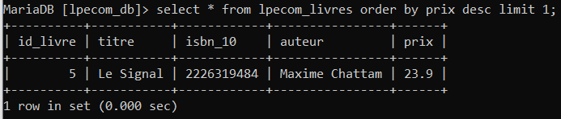
 |

| Ex.5 | Quelle requête utiliser pour récupérer les livres de la table lpecom_livres qui ont un prix compris entre 20 et 22 ? |
| ------------- | ------------- |
| Réponse | `select * from lpecom_livres where prix >= 20 and prix <= 22;` |
| - | 
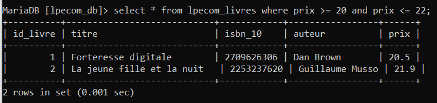
 |

| Ex.6 | Quelle requête utiliser pour récupérer tous les livres de la table lpecom_livres à l'exception de celui portant la valeur pour la colonne isbn_10 : 2092589547 ? |
| ------------- | ------------- |
| Réponse | `select * from lpecom_livres where isbn_10 != 2092589547;` |
| - | 

 |

| Ex.7 | Quelle requête utiliser pour récupérer le prix du livre le moins élevé de la table lpecom_livres en renommant la colonne dans les résultats par minus ? |
| ------------- | ------------- |
| Réponse | `select prix as minus from lpecom_livres order by prix asc limit 1;` |
| - | 
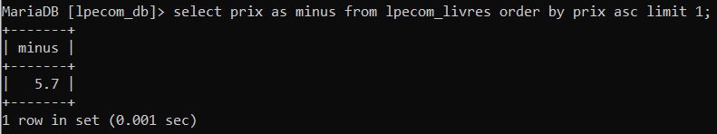
 |

| Ex.8 | Quelle requête utiliser pour sélectionner uniquement les 3 premiers résultats sans le tout premier de la table lpecom_livres ? |
| ------------- | ------------- |
| Réponse | `select * from lpecom_livres order by prix desc limit 3 offset 1;` |
| - | 
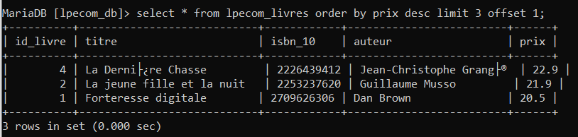
 |

| Ex.9 | Quelle requête utiliser pour afficher l'id des étudiants qui ont participé à au moins un examen ? |
| ------------- | ------------- |
| Réponse | `select * from lpecom_etudiants as lpet, lpecom_examens as lpex where lpet.id_etudiant=lpex .id_etudiant;` |
| - | 
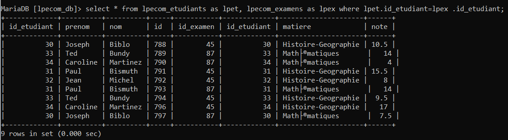
 |

| Ex.10 | Quelle requête utiliser pour compter le nombre d'étudiants qui ont participé à au moins un examen ? |
| ------------- | ------------- |
| Réponse | `select count(distinct(lpecom_etudiants.id_etudiant)) as nbParticipantsExamen from lpecom_etudiants inner join lpecom_examens on lpecom_etudiants.id_etudiant=lpecom_examens.id_etudiant;` |
| - | 
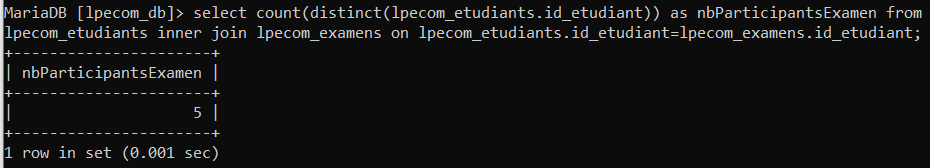
 |

| Ex.11 | Quelle requête utiliser pour calculer la moyenne de l'examen portant l'id : 45 ? |
| ------------- | ------------- |
| Réponse | `select avg(note) from lpecom_examens where id_examen=45;` |
| - | 
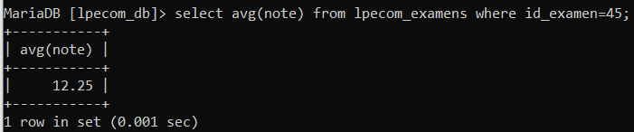
 |

| Ex.12 | Quelle requête utiliser pour récupérer la meilleure note de l'examen portant l'id : 87 ? |
| ------------- | ------------- |
| Réponse | `select max(note) from lpecom_examens where id_examen=87;` |
| - | 
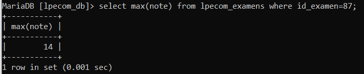
 |

| Ex.13 | Quelle requête utiliser pour afficher l'id des étudiants qui ont eu plus de 11 à l'examen 45 ou plus de 12 à l'examen 87 ? |
| ------------- | ------------- |
| Réponse | `select id_etudiant from lpecom_examens where (id_examen=45 and note>11) or (id_examen=87 and note>12);` |
| - | 
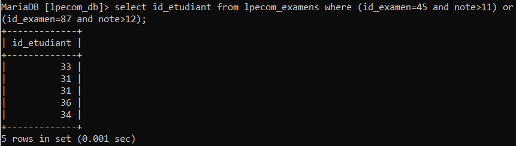
 |

| Ex.14 | Quelle requête utiliser pour afficher tous les enregistrements de la table lpecom_examens avec en plus, si c'est possible, le prénom et le nom de l'étudiant ? |
| ------------- | ------------- |
| Réponse | `select * from lpecom_examens inner join lpecom_etudiants on lpecom_examens.id_etudiant=lpecom_etudiants.id_etudiant;` |
| - | 
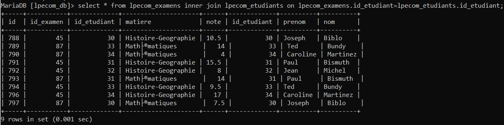
 |

| Ex.15 | Quelle requête utiliser pour afficher les enregistrements de la table lpecom_examens avec le prénom et le nom de l'étudiant, uniquement quand les étudiants sont présents dans la table lpecom_etudiants ? |
| ------------- | ------------- |
| Réponse | `select * from lpecom_examens inner join lpecom_etudiants where lpecom_examens.id_etudiant=lpecom_etudiants.id_etudiant;` |
| - | 
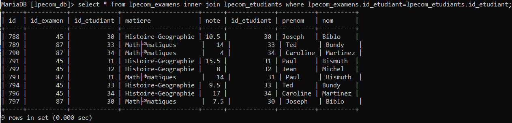
 |

| Ex.16 | Quelle requête utiliser pour afficher uniquement le nom et le prénom de l'étudiant avec l'id : 30 avec la moyenne de ses deux examens dans une colonne moyenne ? |
| ------------- | ------------- |
| Réponse | `select nom, prenom, avg(note) as moyenne from lpecom_examens inner join lpecom_etudiants where lpecom_examens.id_etudiant=30;` |
| - | 
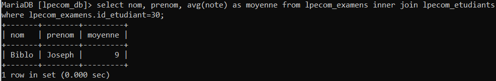
 |

| Ex.17 | Quelle requête utiliser pour afficher les 3 meilleurs examens, du meilleur au moins bon, avec le prénom et le nom de l'étudiant associé ? |
| ------------- | ------------- |
| Réponse | `select * from lpecom_examens inner join lpecom_etudiants where lpecom_examens.id_etudiant=lpecom_etudiants.id_etudiant order by note desc limit 3;` |
| - | 
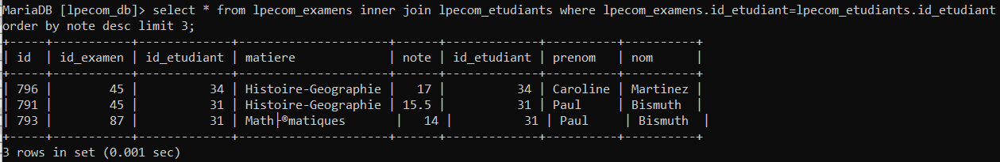
 |

| Ex.18 | Quel est le résultat de la requête ci-dessous ? |
| ------------- | ------------- |
| Réponse | `SELECT id, prenom, nom FROM lpecom_realisateurs WHERE nation = "us" AND sexe = 1;` |
| - | 
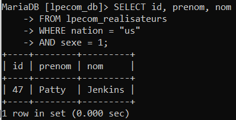
 |

| Ex.19 | Quel est le résultat de la requête ci-dessous ? |
| ------------- | ------------- |
| Réponse | `SELECT * FROM lpecom_realisateurs WHERE sexe = "0" ORDER BY nom DESC LIMIT 1;` |
| - | 
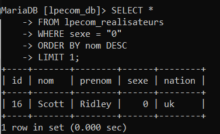
 |

| Ex.20 | Quel est le résultat de la requête ci-dessous ? |
| ------------- | ------------- |
| Réponse | `SELECT f.id, f.nom AS film, r.prenom, r.nom FROM lpecom_films f INNER JOIN lpecom_realisateurs r ON f.id_realisateur = r.id   ORDER BY f.id ASC;` |
| - | 
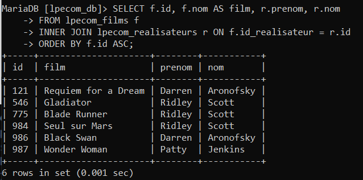
 |

| Ex.21 | Quel est le résultat de la requête ci-dessous ? |
| ------------- | ------------- |
| Réponse | `SELECT f.id, f.nom AS film, r.prenom, r.nom FROM lpecom_films f LEFT JOIN lpecom_realisateurs r ON f.id_realisateur = r.id ORDER BY f.id ASC;` |
| - | 
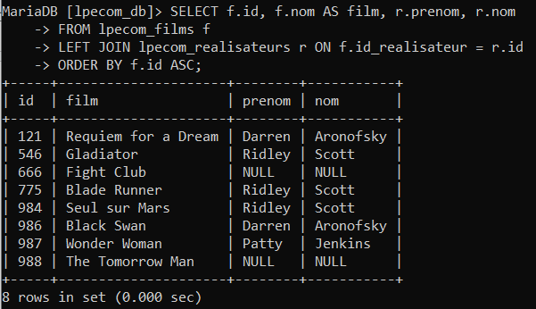
 |

| Ex.22 | Quel est le résultat de la requête ci-dessous ? |
| ------------- | ------------- |
| Réponse | `SELECT f.id, f.nom, fn.note FROM lpecom_films f LEFT JOIN lpecom_films_notes fn ON f.id = fn.id_film ORDER BY f.id ASC;` |
| - | 
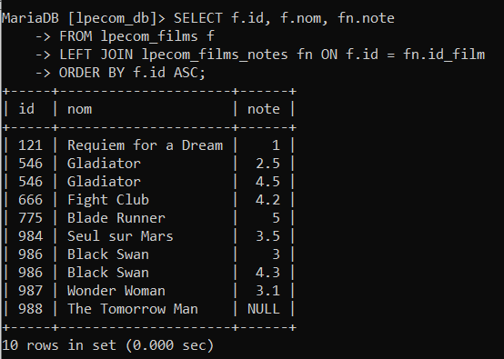
 |

| Ex.23 | Quel est le résultat de la requête ci-dessous ? |
| ------------- | ------------- |
| Réponse | `SELECT f.nom, r.prenom AS realisateur_prenom, r.nom AS realisateur_nom, AVG(fn.note) AS moyenne_note FROM lpecom_films f INNER JOIN lpecom_realisateurs r ON f.id_realisateur = r.id INNER JOIN lpecom_films_notes fn ON f.id = fn.id_film WHERE f.id = 546` |
| - | 
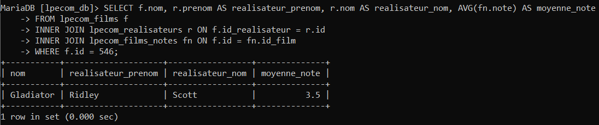
 |

| Ex.24 | Quel est le résultat de la requête ci-dessous ? |
| ------------- | ------------- |
| Réponse | `SELECT r.nation, AVG(fn.note) AS moyenne_note FROM lpecom_films f INNER JOIN lpecom_realisateurs r ON f.id_realisateur = r.id INNER JOIN lpecom_films_notes fn ON f.id = fn.id_film WHERE r.nation = 'us';` |
| - | 
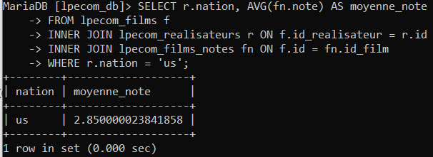
 |

| Ex.25 | Quel est le résultat de la requête ci-dessous ? |
| ------------- | ------------- |
| Réponse | `SELECT r.nation, MAX(fn.note) AS max_note FROM lpecom_films f INNER JOIN lpecom_realisateurs r ON f.id_realisateur = r.id INNER JOIN lpecom_films_notes fn ON f.id = fn.id_film WHERE r.nation = 'uk';` |
| - | 
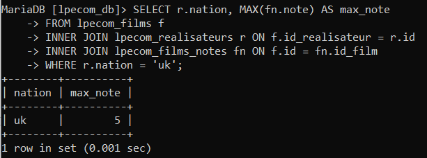
 |

| Ex.26 | Quelle requête utiliser pour retrouver la ville qui possède les coordonnées GPS suivantes : 48.66913724637683, 1.87586057971015 ? |
| ------------- | ------------- |
| Réponse | `select name, gps_lat, gps_lng from lpecom_cities where gps_lat=48.66913724637683 and gps_lng=1.87586057971015;` |
| - | 
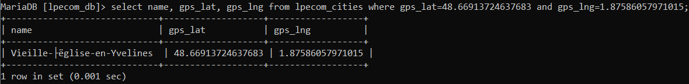
 |

| Ex.27 | Sans jointure, quelle requête utiliser pour calculer le nombre de villes que compte le département de l'Essonne ? |
| ------------- | ------------- |
| Réponse | `select count(lc.name) as nbVilleEssone from lpecom_departments ld, lpecom_cities lc where ld.name=’Essonne’ and (lc.department_code=ld.code);` |
| - | 
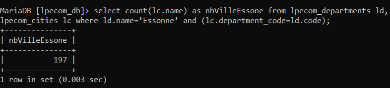
 |

| Ex.28 | Sans jointure, quelle requête utiliser pour calculer le nombre de villes en Île-de-France se terminant par '-le-Roi' ? |
| ------------- | ------------- |
| Réponse | `select count(*) from lpecom_cities lc, lpecom_departments ld, lpecom_regions lr where (lr.name='Île-de-France') and (lr.code=ld.region_code) and (ld.code=lc.department_code) and (lc.name like '%-le-Roi');` |
| - | 
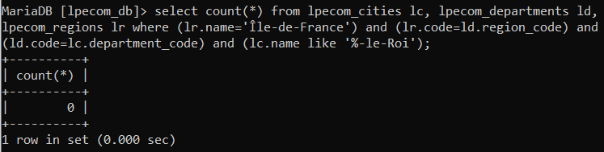
 |

| Ex.29 | Combien de villes possèdent le code postal (zip_code) 77320 ? Renommez la colonne de résultat n_cities. |
| ------------- | ------------- |
| Réponse | `select count(name) as n_cities from lpecom_cities where zip_code=77320;` |
| - | 
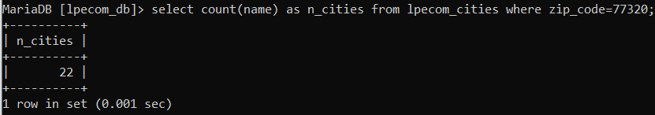
 |

| Ex.30 | Sans jointure, quelle requête utiliser pour calculer le nombre de villes commençant par 'Saint-' en Seine-et-Marne ? |
| ------------- | ------------- |
| Réponse | `select count(*) from lpecom_cities lc, lpecom_departments ld where (lc.name like 'Saint-%' and ld.name='Seine-et-Marne') and (lc.department_code=ld.code);` |
| - | 
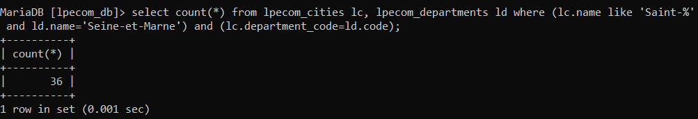
 |

| Ex.31 | Quelles villes possèdent un code postal (zip_code) compris entre 77210 et 77810 ? |
| ------------- | ------------- |
| Réponse | `select name, zip_code from lpecom_cities  where zip_code>=77210 and zip_code<=77810;` |
| - | 
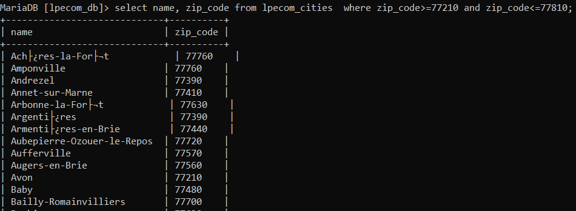
 |

| Ex.32 | Sans jointure, quelles sont les deux villes de Seine-et-Marne à avoir le code postal (zip_code) le plus grand ? |
| ------------- | ------------- |
| Réponse | `select lc.name, zip_code from lpecom_cities lc, lpecom_departments ld where (ld.name='Seine-et-Marne') and (lc.department_code=ld.code) order by zip_code desc limit 2;` |
| - | 
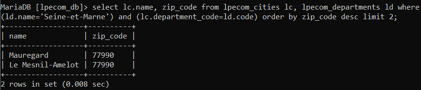
 |

| Ex.33 | Quel est le code postal (zip_code) le plus grand de la table lpecom_cities ? |
| ------------- | ------------- |
| Réponse | `select name, zip_code from lpecom_cities lc order by zip_code desc limit 1;` |
| - | 
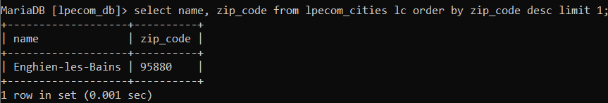
 |

| Ex.34 | Avec un seul WHERE et aucun OR, quelle est la requête permettant d'afficher les départements des régions ayant le code suivant : 75, 27, 53, 84 et 93 ? Le résultat doit afficher le nom du département ainsi que le nom et le slug de la région associée. |
| ------------- | ------------- |
| Réponse | `select ld.name, lr.name, lr.slug from lpecom_departments ld, lpecom_regions lr where ld.region_code=lr.code and ld.region_code in (‘75’, ‘27’, ‘53’, ‘84’, ‘93’);` |
| - | 
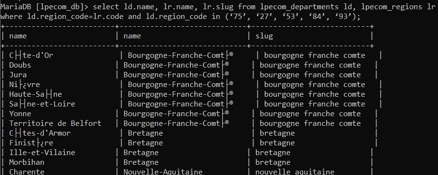
 |

| Ex.35 | Point important, il sera sans doute nécessaire d'utiliser AS pour obtenir le résultat souhaité. Quelle requête utiliser pour obtenir en résultat, les noms de la région, du département et de chaque ville du département ayant pour code 77 ? |
| ------------- | ------------- |
| Réponse | `select lr.name, ld.name, lc.name from lpecom_departments ld, lpecom_regions lr, lpecom_cities lc where (lc.department_code=ld.code) and (ld.region_code=lr.code) and ld.code=‘77’;` |
| - | 
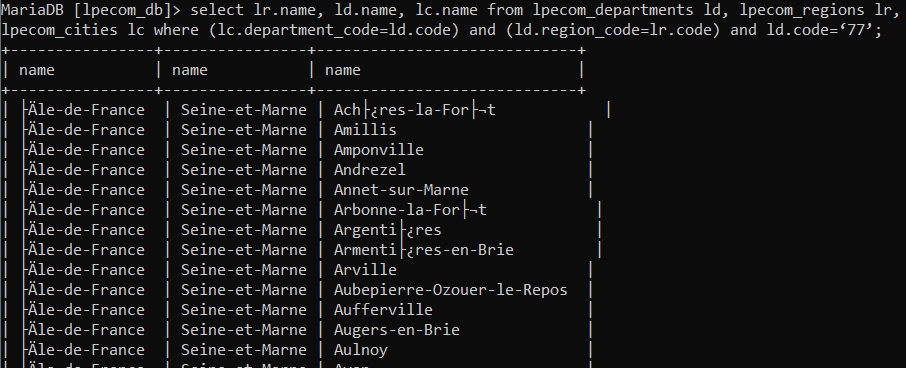
 |